# SM35 Generator - Passwortänderungen
## Download
[Windows](https://www.dropbox.com/s/1jqh34f4dtdnxh7/SM35_Massen_Passwortaenderungen-win32-x64.zip?dl=0)
## Schritt 1
Eingeben des neuen Passworts für ALLE Benutzer die bei Schritt 2 angegeben werden:
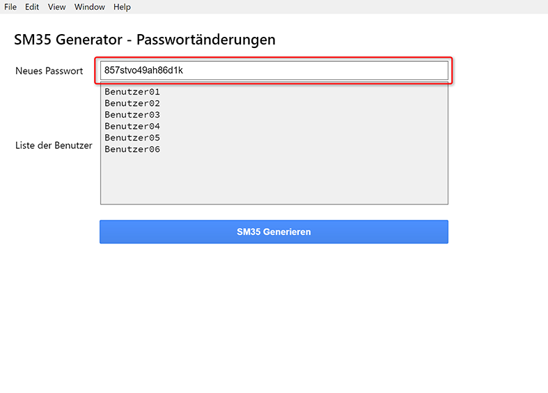

## Schritt 2
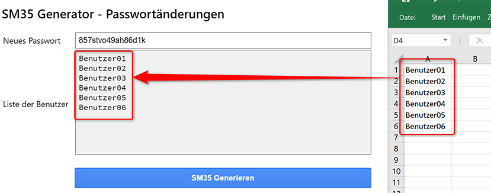

## Schritt 3
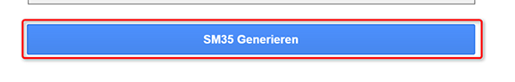

## Schritt 4 

## Schritt 5 
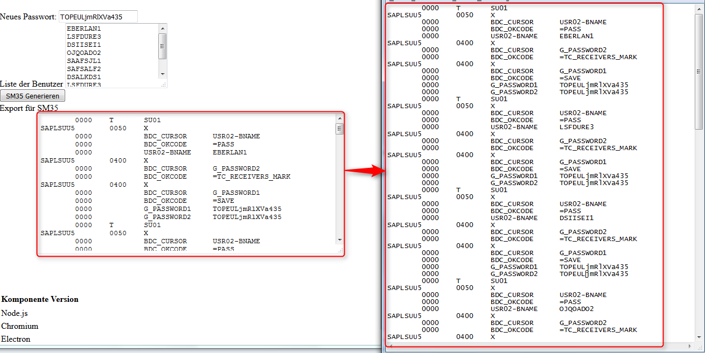

## Schritt 6 
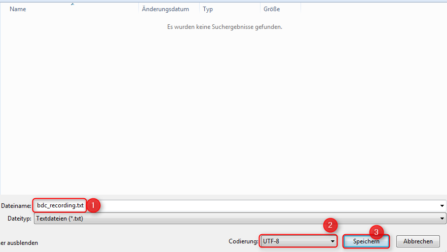

## Schritt 7

## Schritt 8
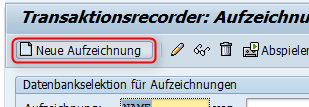

## Schritt 9
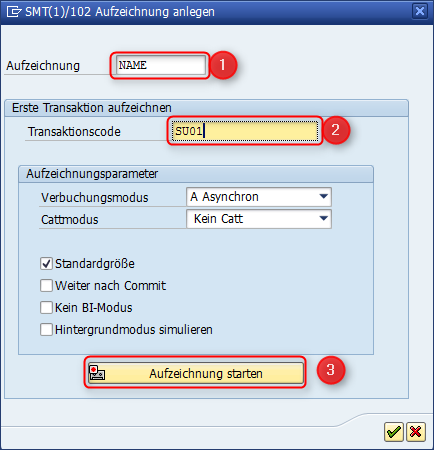

## Schritt 10
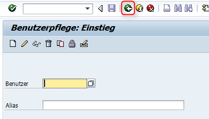

## Schritt 11
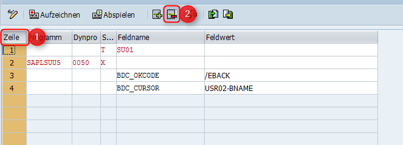

## Schritt 12
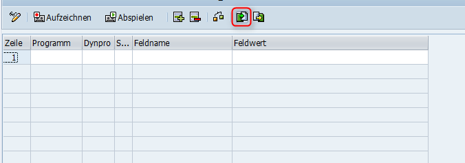

## Schritt 13
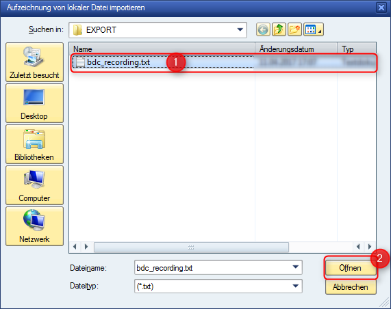

## Schritt 14
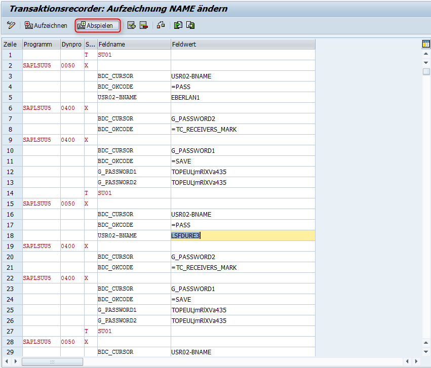

## Schritt 15
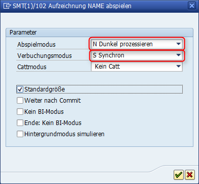