# SM35 Generator - Passwortänderungen
## Schritt 1
Eingeben des neuen Passworts für ALLE Benutzer die bei Schritt 2 angegeben werden:
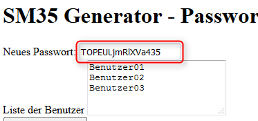

## Schritt 2
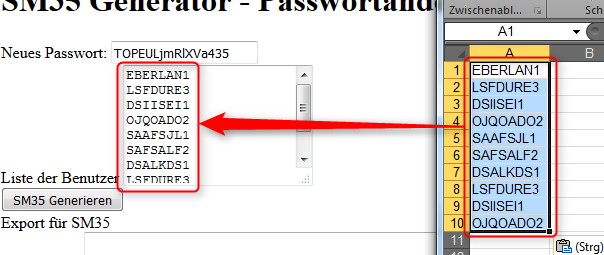

## Schritt 3
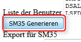

## Schritt 4 
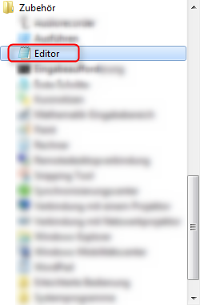

## Schritt 5 
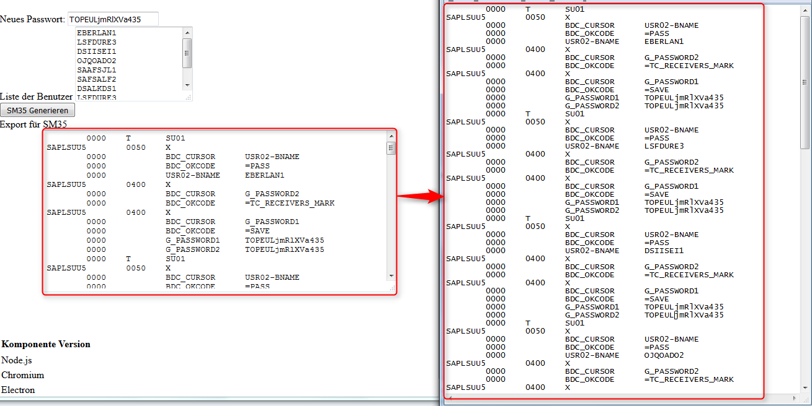

## Schritt 6 
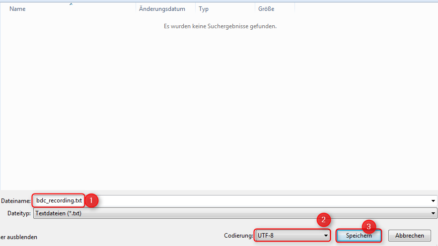

## Schritt 7
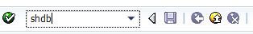

## Schritt 8

## Schritt 9
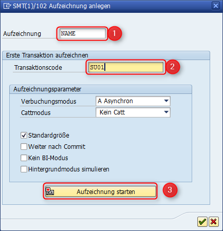

## Schritt 10
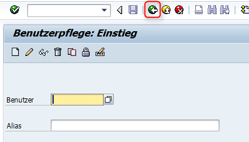

## Schritt 11
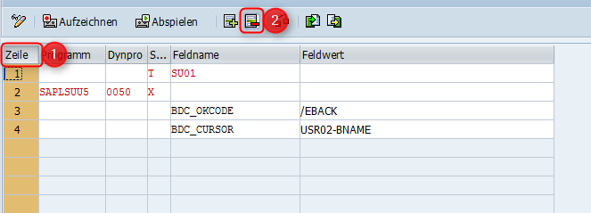

## Schritt 12
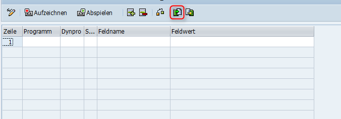

## Schritt 13
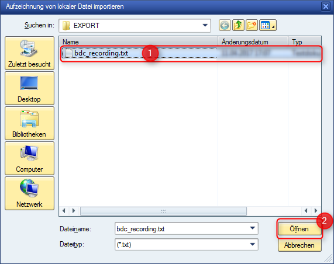

## Schritt 14
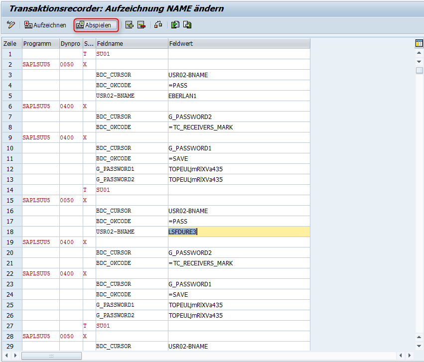

## Schritt 15
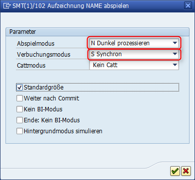